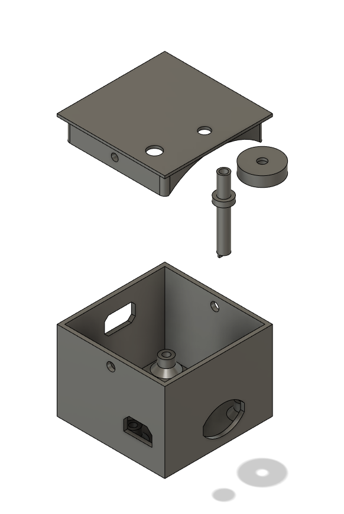

# Enclosure
This is a somewhat generic enclosure I made for the Teensy 4.0 and Audio Shield. It exposes the headphone jack, micro USB port, SD card slot, and volume knob. The audio shield is mounted to the case with M3 screws and integrated standoffs. The lid is press-fit, but can be re-enforced with M3 screws. There's a rod that goes between the volume knob and a hole in the top of the case that and allows the volume to be adjusted with an external knob. I'm honestly surprised by how well this has worked, so far the rod has never slipped off the potentiometer in use. I was concerned that it would. I did have to use a screw to hold the knob onto the rod, a tighter fit there would be nice, maybe change it to a square so it doesn't slip.

The model was created in Fusion 360. Included here are a Fusion 360 archive file, a 3mf export, and STLs of all four bodies.

